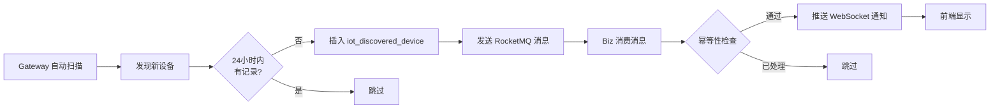
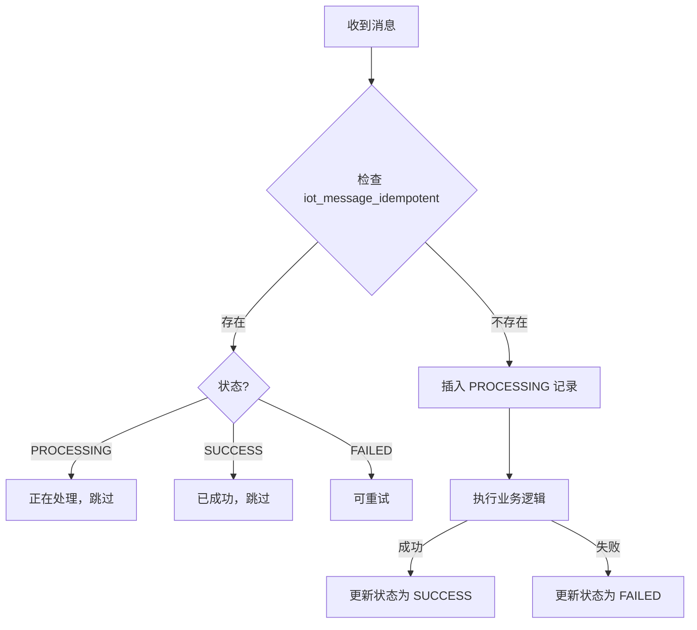

# IoT 设备发现和消息幂等性表结构说明

## 📋 表清单

### 1. iot_discovered_device - 发现设备表

**用途**：记录通过自动发现功能找到的设备

**主要字段**：
- `ip` - IP地址（必填）
- `mac` - MAC地址
- `vendor` - 厂商（如：Hikvision、Dahua）
- `model` - 型号
- `device_type` - 设备类型（camera、sensor、gateway等）
- `discovery_method` - 发现方式（ONVIF、SSDP、ARP、MDNS）
- `discovery_time` - 发现时间
- `status` - 状态：
  - 1 = 已发现
  - 2 = 已通知
  - 3 = 已忽略
  - 4 = 待处理
  - 5 = 已注册
- `added` - 是否已添加到平台
- `device_id` - 平台设备ID（关联 iot_device 表）

**忽略功能字段**：
- `ignored_by` - 忽略操作人ID
- `ignored_time` - 忽略时间
- `ignore_reason` - 忽略原因
- `ignore_until` - 忽略截止时间（NULL=永久忽略）

**索引**：
- 唯一索引：`uk_ip_discovery_time` (ip, discovery_time, deleted)
- 普通索引：ip, status, discovery_time, device_id 等

### 2. iot_message_idempotent - 消息幂等性检查表

**用途**：确保 RocketMQ 消息只被处理一次，防止重复消费

**主要字段**：
- `message_id` - 消息ID（业务生成，如：`192.168.1.100_2025-10-27T10:00:00`）
- `topic` - 消息主题（RocketMQ Topic）
- `status` - 状态：
  - `PROCESSING` = 处理中
  - `SUCCESS` = 成功
  - `FAILED` = 失败
- `processed_time` - 处理完成时间
- `error_message` - 错误信息

**索引**：
- 唯一索引：`uk_message_id_topic` (message_id, topic, deleted)
- 普通索引：(topic, status), create_time

## 🚀 快速使用

### 方式1：使用批处理脚本（推荐）

```bash
# Windows
cd ruoyi-vue-pro/sql/mysql
一键创建设备发现表.bat
```

### 方式2：手动执行 SQL

```bash
# 1. 连接数据库
mysql -hlocalhost -P3306 -uroot -p

# 2. 选择数据库
USE ch_ibms;

# 3. 执行脚本
source iot_tables_device_discovery_and_message.sql;

# 或者直接执行
mysql -hlocalhost -P3306 -uroot -p ch_ibms < iot_tables_device_discovery_and_message.sql
```

### 方式3：使用可视化工具

1. 打开 Navicat / DBeaver / MySQL Workbench
2. 连接到 `ch_ibms` 数据库
3. 打开并执行 `iot_tables_device_discovery_and_message.sql`

## 🔍 验证表是否创建成功

```sql
-- 查看表结构
SHOW CREATE TABLE iot_discovered_device;
SHOW CREATE TABLE iot_message_idempotent;

-- 查看表信息
SELECT 
    TABLE_NAME AS '表名',
    TABLE_COMMENT AS '表注释',
    TABLE_ROWS AS '预估行数',
    CREATE_TIME AS '创建时间'
FROM 
    information_schema.TABLES
WHERE 
    TABLE_SCHEMA = 'ch_ibms'
    AND TABLE_NAME IN ('iot_discovered_device', 'iot_message_idempotent');

-- 查看索引
SHOW INDEX FROM iot_discovered_device;
SHOW INDEX FROM iot_message_idempotent;
```

## 📊 业务流程

### 设备发现流程



### 消息幂等性流程



## 🔧 数据维护

### 定期清理过期数据

```sql
-- 清理 30 天前的成功记录
DELETE FROM iot_message_idempotent 
WHERE status = 'SUCCESS' 
  AND create_time < DATE_SUB(NOW(), INTERVAL 30 DAY);

-- 清理 90 天前的发现设备记录（已注册的除外）
DELETE FROM iot_discovered_device 
WHERE status != 5  -- 非已注册状态
  AND create_time < DATE_SUB(NOW(), INTERVAL 90 DAY);
```

### 查询统计信息

```sql
-- 发现设备统计
SELECT 
    status,
    CASE status
        WHEN 1 THEN '已发现'
        WHEN 2 THEN '已通知'
        WHEN 3 THEN '已忽略'
        WHEN 4 THEN '待处理'
        WHEN 5 THEN '已注册'
    END AS status_name,
    COUNT(*) AS count
FROM iot_discovered_device
WHERE deleted = 0
GROUP BY status;

-- 消息处理统计
SELECT 
    topic,
    status,
    COUNT(*) AS count,
    MIN(create_time) AS first_time,
    MAX(create_time) AS last_time
FROM iot_message_idempotent
WHERE deleted = 0
GROUP BY topic, status;
```

## ⚠️ 注意事项

1. **备份数据**：执行前请务必备份数据库
2. **权限检查**：确保数据库用户有 CREATE TABLE 权限
3. **索引优化**：根据实际查询情况调整索引
4. **数据清理**：建议定期清理过期数据，避免表过大
5. **唯一索引**：注意 `message_id + topic` 的唯一性约束

## 🔗 相关文档

- [IoT 模块文档中心](../../yudao-module-iot/docs/README.md)
- [设备发现业务流程分析](../../yudao-module-iot/docs/sessions/session_20251026_设备发现业务流程分析与改进.md)
- [RocketMQ Topic 命名规范](../../yudao-module-iot/docs/IoT消息主题命名规范.md)

## 📝 更新日志

- **2025-10-27**: 初始版本，创建设备发现和消息幂等性表

---

**维护团队**：长辉信息科技有限公司  
**版本**：v2025.09-SNAPSHOT


