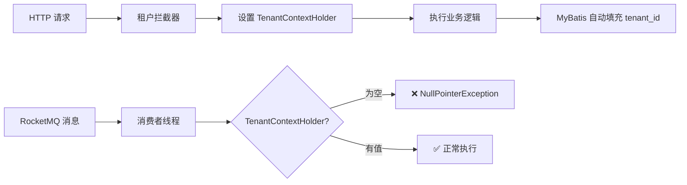

# 多租户上下文缺失 - RocketMQ 消费者租户拦截错误

## 错误信息

```
org.mybatis.spring.MyBatisSystemException: 
### Error updating database.  Cause: java.lang.NullPointerException: 
TenantContextHolder 不存在租户编号！可参考文档：https://doc.changhui-tech.com
### The error may exist in cn/iocoder/yudao/module/iot/dal/mysql/message/IotMessageIdempotentMapper.java (best guess)
### The error may involve cn.iocoder.yudao.module.iot.dal.mysql.message.IotMessageIdempotentMapper.insert
### The error occurred while executing an update
### Cause: java.lang.NullPointerException: TenantContextHolder 不存在租户编号！
```

## 错误原因

### 问题分析

**芋道源码是一个多租户 SaaS 框架**，具有以下特点：

1. **自动租户隔离**
   - 所有继承 `BaseDO` 的实体都有 `tenant_id` 字段
   - MyBatis 拦截器会自动在 SQL 中添加 `tenant_id` 条件
   - INSERT/UPDATE 时自动填充 `tenant_id`

2. **租户上下文**
   - HTTP 请求会自动解析租户ID并设置到 `TenantContextHolder`
   - 租户拦截器从 `TenantContextHolder` 获取当前租户ID

3. **RocketMQ 消费者的问题**
   - RocketMQ 消费者运行在独立线程中，**不是 HTTP 请求**
   - 没有租户上下文（`TenantContextHolder` 为空）
   - 租户拦截器尝试获取租户ID时抛出 `NullPointerException`

### 技术原理



### 为什么会有这个问题？

在开发时**忘记了项目基于芋道源码的多租户框架**，导致：
- ✅ 代码逻辑正确
- ✅ 数据库表结构正确（有 `tenant_id` 字段）
- ❌ **没有处理租户隔离问题**

## 解决方案

### 方案1：使用 @TenantIgnore（推荐）

在 Service 方法上添加 `@TenantIgnore` 注解，忽略租户隔离。

#### MessageIdempotentServiceImpl

```java
import cn.iocoder.yudao.framework.tenant.core.aop.TenantIgnore;

@Service
public class MessageIdempotentServiceImpl implements MessageIdempotentService {
    
    @Override
    @TenantIgnore // 忽略租户隔离：因为 RocketMQ 消费者调用时，未传递租户上下文
    public boolean tryProcess(String messageId, String topic) {
        // ...
    }
    
    @Override
    @TenantIgnore // 忽略租户隔离：因为 RocketMQ 消费者调用时，未传递租户上下文
    public void markSuccess(String messageId) {
        // ...
    }
    
    @Override
    @TenantIgnore // 忽略租户隔离：因为 RocketMQ 消费者调用时，未传递租户上下文
    public void markFailed(String messageId, String errorMessage) {
        // ...
    }
}
```

#### DiscoveredDeviceServiceImpl

```java
import cn.iocoder.yudao.framework.tenant.core.aop.TenantIgnore;

@Service
public class DiscoveredDeviceServiceImpl implements DiscoveredDeviceService {
    
    @Override
    @TenantIgnore // 忽略租户隔离：因为 RocketMQ 消费者调用时，未传递租户上下文
    public boolean saveDiscoveredDevice(DiscoveredDevice device, boolean added) {
        // ...
    }
    
    @Override
    @TenantIgnore // 忽略租户隔离：跨租户查询
    public List<DiscoveredDevice> getRecentDiscoveredDevices(Integer hours) {
        // ...
    }
}
```

**优点**：
- ✅ 简单、直接
- ✅ 符合芋道源码规范
- ✅ 无需修改消费者代码

**适用场景**：
- RocketMQ 消费者
- 定时任务
- 系统级操作（跨租户）

### 方案2：使用 @InterceptorIgnore（Mapper 级别）

在 Mapper 接口上添加注解，避免租户拦截。

```java
import cn.iocoder.yudao.framework.mybatis.core.mapper.BaseMapperX;
import cn.iocoder.yudao.framework.web.config.WebProperties;
import com.baomidou.mybatisplus.annotation.InterceptorIgnore;

@Mapper
@InterceptorIgnore(tenantLine = "true") // 忽略租户拦截
public interface IotMessageIdempotentMapper extends BaseMapperX<IotMessageIdempotentDO> {
    // ...
}
```

**优点**：
- 直接在 SQL 层面忽略
- 适合整个 Mapper 都需要跨租户的场景

**缺点**：
- 影响范围较大
- 可能导致意外的跨租户访问

### 方案3：手动设置租户上下文

在消费者中手动设置租户上下文。

```java
import cn.iocoder.yudao.framework.tenant.core.context.TenantContextHolder;
import cn.iocoder.yudao.framework.tenant.core.util.TenantUtils;

@Component
public class DeviceDiscoveredConsumer implements IotMessageSubscriber<DiscoveredDevice> {
    
    @Override
    public void onMessage(DiscoveredDevice device) {
        // 方式1：手动设置租户ID
        TenantContextHolder.setTenantId(1L); // 设置默认租户
        try {
            // 业务逻辑
        } finally {
            TenantContextHolder.clear(); // 清理上下文
        }
        
        // 方式2：使用工具类
        TenantUtils.execute(1L, () -> {
            // 业务逻辑
        });
    }
}
```

**优点**：
- 可以指定具体租户
- 灵活性高

**缺点**：
- 需要知道租户ID
- 代码侵入性强
- 对于设备发现等系统级功能不适用

### 方案对比

| 方案 | 适用场景 | 优点 | 缺点 | 推荐度 |
|------|---------|------|------|--------|
| @TenantIgnore | RocketMQ消费者、定时任务、系统级操作 | 简单、符合规范 | 需要每个方法添加 | ⭐⭐⭐⭐⭐ |
| @InterceptorIgnore | 整个Mapper都需要跨租户 | 一次配置、影响整个Mapper | 影响范围大 | ⭐⭐⭐ |
| 手动设置租户 | 需要在特定租户上下文执行 | 灵活、可控 | 代码侵入、需要知道租户ID | ⭐⭐ |

## 涉及文件

### 已修复的文件

1. `MessageIdempotentServiceImpl.java`
   - `tryProcess()` - 添加 `@TenantIgnore`
   - `markSuccess()` - 添加 `@TenantIgnore`
   - `markFailed()` - 添加 `@TenantIgnore`

2. `DiscoveredDeviceServiceImpl.java`
   - `saveDiscoveredDevice()` - 添加 `@TenantIgnore`
   - `getRecentDiscoveredDevices()` - 添加 `@TenantIgnore`
   - `getUnaddedDevices()` - 添加 `@TenantIgnore`

3. `IotDeviceServiceImpl.java`
   - `isDeviceExistsByIp()` - 添加 `@TenantIgnore`

### 调用链路

```
RocketMQ 消息
  ↓
DeviceDiscoveredConsumer.onMessage()
  ↓
├─ MessageIdempotentService.tryProcess() ← 需要 @TenantIgnore ✅
├─ IotDeviceService.isDeviceExistsByIp() ← 需要 @TenantIgnore ✅
├─ DiscoveredDeviceService.saveDiscoveredDevice() ← 需要 @TenantIgnore ✅
└─ AlertWebSocketHandler.broadcastMessage()
```

## 验证修复

### 1. 重新编译

```bash
cd yudao-module-iot/yudao-module-iot-biz
mvn clean compile -DskipTests
```

**预期结果**：编译成功，无错误

### 2. 重启服务

```bash
mvn spring-boot:run
```

**预期日志**：
```
[onMessage][收到设备发现消息: 192.168.1.202 (onvif)]
[tryProcess][消息可以处理: 192.168.1.202_2025-10-27...]
[saveDiscoveredDevice][保存发现记录: 192.168.1.202 (onvif)]
[pushNewDeviceNotification][已推送新设备通知: 192.168.1.202 (onvif)]
```

### 3. 验证数据库

```sql
-- 检查幂等性表
SELECT * FROM iot_message_idempotent ORDER BY create_time DESC LIMIT 10;

-- 检查发现设备表
SELECT * FROM iot_discovered_device ORDER BY create_time DESC LIMIT 10;

-- 确认 tenant_id 字段
-- 使用 @TenantIgnore 后，tenant_id 会是默认值 0
```

## 预防措施

### 1. 识别多租户场景

在芋道源码中，以下场景需要注意租户隔离：

| 场景 | 是否有租户上下文 | 处理方式 |
|------|----------------|---------|
| HTTP 请求 | ✅ 有 | 自动处理 |
| RocketMQ 消费者 | ❌ 无 | `@TenantIgnore` |
| 定时任务 | ❌ 无 | `@TenantIgnore` |
| WebSocket 消息 | ⚠️ 可能有 | 手动设置或忽略 |
| 系统初始化 | ❌ 无 | `@TenantIgnore` |
| 跨租户查询 | - | `@TenantIgnore` |

### 2. 开发检查清单

在实现 RocketMQ 消费者时：

- [ ] 是否继承了 `BaseDO`？（有 `tenant_id` 字段）
- [ ] 消费者是否在 HTTP 请求之外？
- [ ] Service 方法是否添加 `@TenantIgnore`？
- [ ] 是否需要跨租户查询？
- [ ] 测试时是否验证了租户隔离？

### 3. 代码审查要点

```java
// ❌ 错误：RocketMQ 消费者调用的 Service 方法未加 @TenantIgnore
@Service
public class SomeService {
    public void handle() {
        // 插入数据，会触发租户拦截器
        mapper.insert(entity);
    }
}

// ✅ 正确：添加 @TenantIgnore
@Service
public class SomeService {
    @TenantIgnore // 说明原因
    public void handle() {
        mapper.insert(entity);
    }
}
```

### 4. 单元测试

```java
@Test
public void testRocketMQConsumer() {
    // 模拟 RocketMQ 消息消费（无租户上下文）
    DeviceDiscoveredConsumer consumer = new DeviceDiscoveredConsumer();
    DiscoveredDevice device = new DiscoveredDevice();
    device.setIp("192.168.1.100");
    
    // 应该不抛出租户异常
    assertDoesNotThrow(() -> consumer.onMessage(device));
}
```

## 相关错误

- `TenantContextHolder 不存在租户编号` - 租户上下文缺失
- `Invalid tenant id` - 租户ID无效
- `Tenant not found` - 租户不存在

## 参考资料

- [芋道源码 - 多租户](https://doc.iocoder.cn/saas-tenant/)
- [芋道源码 - @TenantIgnore 注解](https://doc.iocoder.cn/saas-tenant/#_4-tenantignore-%E6%B3%A8%E8%A7%A3)
- [长辉科技文档](https://doc.changhui-tech.com)

## 💡 经验总结

### 关键教训

**在基于框架的二次开发中，必须深入理解框架的核心机制**：

1. ✅ **芋道源码 = 多租户 SaaS 框架**
   - 所有 DO 都有 `tenant_id`
   - HTTP 请求自动设置租户上下文
   - **RocketMQ/定时任务需要特殊处理**

2. ✅ **设计系统级功能时要考虑租户隔离**
   - 设备发现是系统级功能，应该跨租户
   - 使用 `@TenantIgnore` 明确表达意图
   - 添加注释说明原因

3. ✅ **消息队列场景的特殊性**
   - 不是 HTTP 请求
   - 没有用户会话
   - 没有租户上下文
   - 需要显式处理

### 最佳实践

```java
// ✅ 推荐：明确注释，说明为什么忽略租户
@Override
@TenantIgnore // 忽略租户隔离：因为 RocketMQ 消费者调用时，未传递租户上下文
public boolean tryProcess(String messageId, String topic) {
    // ...
}

// ✅ 推荐：对于跨租户查询，也说明原因
@Override
@TenantIgnore // 忽略租户隔离：系统级设备发现功能，需要跨租户查询
public List<DiscoveredDevice> getRecentDiscoveredDevices(Integer hours) {
    // ...
}
```

---

**错误时间**：2025-10-27  
**修复状态**：✅ 已修复  
**影响范围**：RocketMQ 消费者、设备发现、消息幂等性  
**修复版本**：v2025.09-SNAPSHOT  
**重要程度**：⭐⭐⭐⭐⭐ 关键错误（阻塞功能）

