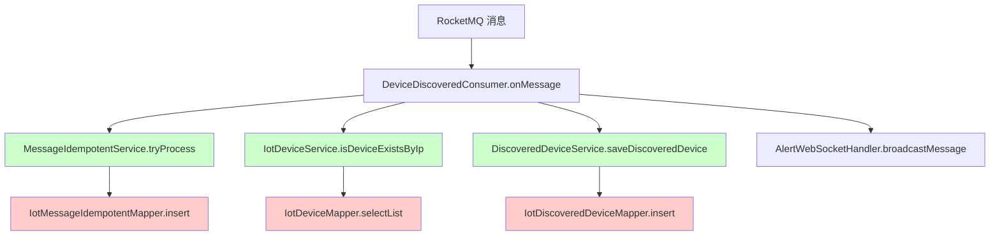

# 多租户 - RocketMQ 消费者完整检查清单

## 📋 问题背景

在芋道源码的多租户框架中，RocketMQ 消费者线程**没有租户上下文**，任何涉及数据库操作的方法都需要添加 `@TenantIgnore` 注解。

## ✅ 设备发现消费者完整检查

### DeviceDiscoveredConsumer 调用链路



### 已修复的方法清单

| 类 | 方法 | 状态 | 说明 |
|---|------|------|------|
| `MessageIdempotentServiceImpl` | `tryProcess()` | ✅ 已修复 | 插入幂等性记录 |
| `MessageIdempotentServiceImpl` | `markSuccess()` | ✅ 已修复 | 更新成功状态 |
| `MessageIdempotentServiceImpl` | `markFailed()` | ✅ 已修复 | 更新失败状态 |
| `DiscoveredDeviceServiceImpl` | `saveDiscoveredDevice()` | ✅ 已修复 | 保存发现设备 |
| `DiscoveredDeviceServiceImpl` | `getRecentDiscoveredDevices()` | ✅ 已修复 | 查询最近设备 |
| `DiscoveredDeviceServiceImpl` | `getUnaddedDevices()` | ✅ 已修复 | 查询未添加设备 |
| `IotDeviceServiceImpl` | `isDeviceExistsByIp()` | ✅ 已修复 | 检查设备是否存在 |

## 🔍 如何排查租户上下文问题

### 1. 识别错误特征

**典型错误日志**：
```
org.mybatis.spring.MyBatisSystemException: 
### Error querying database.  Cause: java.lang.NullPointerException: 
TenantContextHolder 不存在租户编号！
```

**关键信息**：
- 错误发生在 RocketMQ 消费者线程
- 涉及 MyBatis 数据库操作
- `TenantContextHolder` 为空

### 2. 快速定位方法

#### 方法1：查看错误堆栈

```
at IotDeviceServiceImpl.isDeviceExistsByIp() ← 这个方法需要 @TenantIgnore
at DeviceDiscoveredConsumer.onMessage()
```

#### 方法2：搜索调用链

```bash
# 搜索消费者中的所有 Service 调用
grep -n "Service\." DeviceDiscoveredConsumer.java

# 检查这些 Service 方法是否有数据库操作
```

#### 方法3：使用 IDE 调用层次

1. 在 IDEA 中打开消费者类
2. 右键 `onMessage` 方法
3. 选择 "Analyze" → "Call Hierarchy"
4. 检查所有调用的 Service 方法

### 3. 验证是否需要 @TenantIgnore

**需要添加的场景**：
```java
// ❌ 需要 @TenantIgnore
public boolean isDeviceExistsByIp(String ip) {
    return deviceMapper.selectList()  // 数据库查询
        .stream()
        .anyMatch(device -> device.getIp().equals(ip));
}

// ✅ 正确
@TenantIgnore
public boolean isDeviceExistsByIp(String ip) {
    return deviceMapper.selectList()
        .stream()
        .anyMatch(device -> device.getIp().equals(ip));
}
```

**不需要添加的场景**：
```java
// ✅ 不需要（无数据库操作）
public void broadcastMessage(WebSocketMessage message) {
    sessions.values().forEach(session -> {
        session.sendMessage(message);
    });
}
```

## 🛠️ 完整验证步骤

### 步骤1：编译验证

```bash
cd F:\work\ch_ibms\ruoyi-vue-pro\yudao-module-iot\yudao-module-iot-biz
mvn clean compile -DskipTests
```

**预期结果**：编译成功，无错误

### 步骤2：启动服务

```bash
cd F:\work\ch_ibms\ruoyi-vue-pro\yudao-server
mvn spring-boot:run
```

### 步骤3：触发设备发现

**方式1：等待自动扫描**
- Gateway 会定期扫描（默认5分钟）
- 观察日志：`[DeviceDiscoveryManager] [discoverDevices]`

**方式2：手动触发**
```bash
# 调用扫描接口
curl -X POST "http://localhost:48080/admin-api/iot/device/discovery/scan" \
  -H "Authorization: Bearer YOUR_TOKEN" \
  -H "Content-Type: application/json" \
  -d '{"scanType": "onvif", "timeout": 5000}'
```

### 步骤4：观察日志（关键）

**正确的日志顺序**：
```
[DeviceDiscoveryManager] [publishDiscoveryEvent][发布设备发现消息: 192.168.1.202 (onvif)]
[DeviceDiscoveredConsumer] [onMessage][收到设备发现消息: 192.168.1.202 (onvif)]
[MessageIdempotentService] [tryProcess][消息可以处理: 192.168.1.202_2025-10-27...]
[IotDeviceService] [isDeviceExistsByIp][检查设备是否存在: 192.168.1.202]
[DiscoveredDeviceService] [saveDiscoveredDevice][保存发现记录: 192.168.1.202 (onvif)]
[AlertWebSocketHandler] [broadcastMessage][推送 WebSocket 消息]
```

**错误的日志（如果还有问题）**：
```
[DeviceDiscoveredConsumer] [onMessage][收到设备发现消息: ...]
ERROR: TenantContextHolder 不存在租户编号！ ← 说明还有方法未添加 @TenantIgnore
```

### 步骤5：验证数据库

```sql
-- 检查幂等性记录
SELECT * FROM iot_message_idempotent 
WHERE topic = 'iot_device_discovered' 
ORDER BY create_time DESC 
LIMIT 10;

-- 检查发现设备记录
SELECT * FROM iot_discovered_device 
ORDER BY discovery_time DESC 
LIMIT 10;

-- 预期结果：两个表都有新记录
```

## 🔧 预防措施

### 开发规范

1. **创建 RocketMQ 消费者时**
   - [ ] 明确标注消费者类注释
   - [ ] 列出所有调用的 Service 方法
   - [ ] 确认每个涉及数据库的方法都有 `@TenantIgnore`

2. **添加新的 Service 方法时**
   - [ ] 检查是否被 RocketMQ 消费者调用
   - [ ] 如果是，添加 `@TenantIgnore` 和注释
   - [ ] 更新调用链文档

3. **代码审查时**
   - [ ] 检查消费者的调用链
   - [ ] 验证所有数据库操作方法的注解
   - [ ] 运行集成测试

### 代码模板

```java
/**
 * RocketMQ 消费者
 * 
 * ⚠️ 重要：此消费者运行在 RocketMQ 线程中，没有租户上下文
 * 所有涉及数据库操作的 Service 方法都必须添加 @TenantIgnore
 * 
 * 调用链路：
 * - MessageIdempotentService.tryProcess() ✅ 已添加 @TenantIgnore
 * - IotDeviceService.isDeviceExistsByIp() ✅ 已添加 @TenantIgnore
 * - DiscoveredDeviceService.saveDiscoveredDevice() ✅ 已添加 @TenantIgnore
 */
@Component
public class DeviceDiscoveredConsumer implements IotMessageSubscriber<DiscoveredDevice> {
    
    @Override
    public void onMessage(DiscoveredDevice device) {
        // 业务逻辑
    }
}
```

## 📊 测试用例

### 单元测试模板

```java
@SpringBootTest
public class DeviceDiscoveredConsumerTest {
    
    @Resource
    private DeviceDiscoveredConsumer consumer;
    
    @Test
    public void testConsumeMessage_NoTenantContext() {
        // 模拟 RocketMQ 消费者环境（无租户上下文）
        TenantContextHolder.clear();
        
        DiscoveredDevice device = new DiscoveredDevice();
        device.setIp("192.168.1.100");
        device.setVendor("Test");
        device.setDiscoveryMethod("ONVIF");
        device.setDiscoveryTime(LocalDateTime.now());
        
        // 应该不抛出租户异常
        assertDoesNotThrow(() -> consumer.onMessage(device));
    }
}
```

## 🔗 相关文档

- [错误记录：多租户上下文缺失](./errors/后端_多租户上下文缺失_RocketMQ消费者租户拦截错误.md)
- [芋道源码 - 多租户](https://doc.iocoder.cn/saas-tenant/)
- [RocketMQ 官方文档](https://rocketmq.apache.org/)

## 📝 快速参考

### 常见 RocketMQ 消费者

| 消费者 | 已检查 | 备注 |
|-------|-------|------|
| DeviceDiscoveredConsumer | ✅ | 设备发现 |
| DeviceOnlineConsumer | ⚠️ | 需要检查 |
| DeviceOfflineConsumer | ⚠️ | 需要检查 |
| DeviceEventConsumer | ⚠️ | 需要检查 |
| ServiceResultConsumer | ⚠️ | 需要检查 |

### 快速检查命令

```bash
# 查找所有 RocketMQ 消费者
grep -r "IotMessageSubscriber" --include="*.java"

# 查找所有 @TenantIgnore 注解
grep -r "@TenantIgnore" --include="*.java"

# 查找可能缺少注解的方法（查询类方法）
grep -r "Mapper.select" --include="*.java" | grep -v "@TenantIgnore"
```

---

**创建时间**：2025-10-27  
**维护团队**：长辉信息科技有限公司  
**最后更新**：2025-10-27  
**重要程度**：⭐⭐⭐⭐⭐ 关键检查清单


