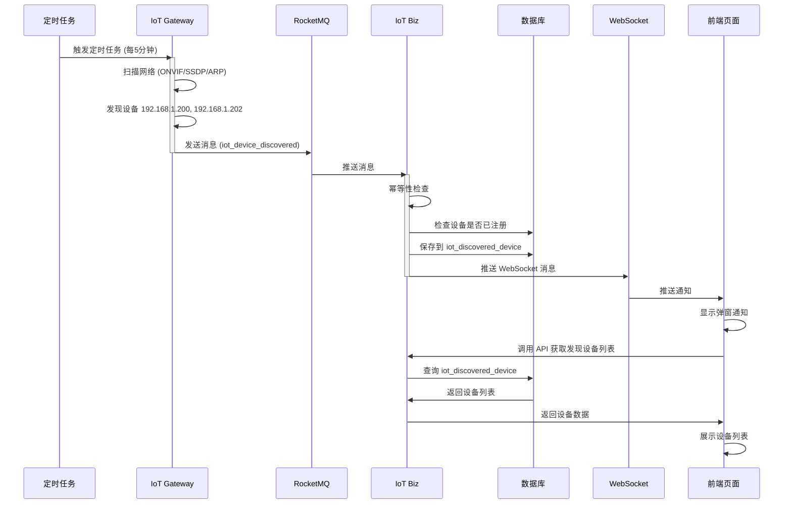

# 设备发现完整业务流程图

## 🎯 业务流程概览



## 📊 详细流程说明

### 阶段1：网关自动发现设备

**触发方式**：定时任务（默认每5分钟）

```java
// Gateway 定时任务
@Scheduled(cron = "${iot.discovery.cron:0 */5 * * * ?}")
public void autoDiscovery() {
    discoverDevices();
}
```

**扫描过程**：
1. **ONVIF 扫描** - 发现支持 ONVIF 协议的摄像头
2. **SSDP 扫描** - 发现支持 UPnP 的设备
3. **ARP 扫描** - 扫描网段内的所有设备

**日志示例**（Gateway）：
```
[ONVIF发现设备: 192.168.1.200 (onvif)]
[ONVIF发现设备: 192.168.1.202 (onvif)]
[发现完成，共 2 个设备，耗时 5885ms]
```

### 阶段2：发送 RocketMQ 消息

**Topic**: `iot_device_discovered`

**消息内容**：
```json
{
  "ip": "192.168.1.202",
  "mac": null,
  "vendor": "onvif",
  "model": null,
  "serialNumber": null,
  "deviceType": "camera",
  "firmwareVersion": null,
  "httpPort": 80,
  "rtspPort": 554,
  "onvifPort": 8999,
  "onvifSupported": true,
  "discoveryMethod": "onvif",
  "discoveryTime": "2025-10-27T13:20:00.036",
  "online": true
}
```

**日志示例**（Gateway）：
```
[post][topic(iot_device_discovered) 发送消息(...) result(SendResult [sendStatus=SEND_OK, ...])]
[publishDiscoveryEvent][发布设备发现消息: 192.168.1.202 (onvif)]
```

### 阶段3：Biz 服务消费消息

**Consumer**: `DeviceDiscoveredConsumer`  
**Consumer Group**: `iot-biz-device-discovered`

**处理流程**：
```java
@Override
public void onMessage(DiscoveredDevice device) {
    // 1. 幂等性检查
    if (!idempotentService.tryProcess(messageId, topic)) {
        return; // 已处理过，跳过
    }
    
    // 2. 检查设备是否已添加到平台
    boolean exists = deviceService.isDeviceExistsByIp(device.getIp());
    
    // 3. 保存发现记录
    boolean isSaved = discoveredDeviceService.saveDiscoveredDevice(device, exists);
    
    // 4. 推送 WebSocket 通知（如果是新设备且未注册）
    if (isSaved && !exists) {
        alertWebSocketHandler.broadcastMessage(message);
    }
}
```

**预期日志**（Biz）：
```
[onMessage][收到设备发现消息: 192.168.1.202 (onvif)]
[tryProcess][消息可以处理: 192.168.1.202_2025-10-27T13:20:00]
[isDeviceExistsByIp][检查设备是否存在: 192.168.1.202]
[saveDiscoveredDevice][保存发现记录: 192.168.1.202 (onvif)]
[pushNewDeviceNotification][已推送新设备通知: 192.168.1.202]
```

### 阶段4：数据持久化

**保存到数据库**：

```sql
-- iot_discovered_device 表
INSERT INTO iot_discovered_device (
    ip, vendor, device_type, discovery_method, 
    discovery_time, added, status
) VALUES (
    '192.168.1.202', 'onvif', 'camera', 'onvif',
    '2025-10-27 13:20:00', 0, 1
);

-- iot_message_idempotent 表（幂等性）
INSERT INTO iot_message_idempotent (
    message_id, topic, status
) VALUES (
    '192.168.1.202_2025-10-27T13:20:00', 
    'iot_device_discovered', 
    'PROCESSING'
);
```

### 阶段5：WebSocket 推送

**连接地址**: `ws://localhost:48080/ws/alert`

**推送消息**：
```json
{
  "type": "device_discovered",
  "title": "发现新设备",
  "data": {
    "type": "NEW_DEVICE_DISCOVERED",
    "device": {
      "ip": "192.168.1.202",
      "vendor": "onvif",
      "deviceType": "camera"
    },
    "timestamp": 1729999200000
  }
}
```

### 阶段6：前端展示（❌ 当前缺失）

**需要实现的功能**：

1. **实时通知**
   ```javascript
   // 监听 WebSocket 消息
   ws.onmessage = (event) => {
     const message = JSON.parse(event.data);
     if (message.type === 'device_discovered') {
       // 显示通知
       ElNotification({
         title: '发现新设备',
         message: `发现新设备：${message.data.device.ip}`,
         type: 'info'
       });
     }
   };
   ```

2. **设备发现页面**
   - 路径：`/iot/device/discovery`
   - 功能：显示未添加的发现设备列表
   - API：`GET /admin-api/iot/device/discovery/unadded`

3. **设备管理页面集成**
   - 在设备管理页面添加"发现设备"按钮
   - 点击后弹出发现设备列表
   - 可以一键添加到平台

## 🔍 当前状态检查

### ✅ 已完成的部分

| 阶段 | 组件 | 状态 | 说明 |
|------|------|------|------|
| 1 | Gateway 定时任务 | ✅ | 每5分钟自动扫描 |
| 2 | Gateway 设备扫描 | ✅ | ONVIF/SSDP/ARP |
| 3 | RocketMQ 消息发送 | ✅ | Topic: iot_device_discovered |
| 4 | Biz 消息消费 | ✅ | DeviceDiscoveredConsumer |
| 5 | 数据库保存 | ✅ | iot_discovered_device |
| 6 | 幂等性检查 | ✅ | iot_message_idempotent |
| 7 | WebSocket 推送 | ✅ | AlertWebSocketHandler |
| 8 | 后端 API | ✅ | /discovery/recent, /discovery/unadded |

### ❌ 缺失的部分

| 功能 | 状态 | 说明 |
|------|------|------|
| 前端发现设备页面 | ❌ | 需要创建 |
| 前端 WebSocket 监听 | ❌ | 需要实现 |
| 前端通知弹窗 | ❌ | 需要实现 |
| 设备管理页面的"发现设备"按钮 | ❌ | 需要添加 |

## 🐛 问题排查

### 为什么 Biz 日志中看不到消费记录？

**可能原因**：

1. **日志级别问题**
   ```yaml
   # 检查 application.yaml
   logging:
     level:
       cn.iocoder.yudao.module.iot: INFO
   ```

2. **RocketMQ 连接问题**
   ```bash
   # 检查 RocketMQ 是否正常
   telnet 192.168.1.126 9876
   ```

3. **Consumer 未启动**
   ```java
   // 检查 @PostConstruct 是否执行
   @PostConstruct
   public void init() {
       messageBus.register(this);
       log.info("[DeviceDiscoveredConsumer] 已注册设备发现消息订阅");
   }
   ```

### 验证步骤

#### 1. 检查 RocketMQ 消息

```bash
# 使用 RocketMQ Dashboard
http://192.168.1.126:9999/#/topic/detail?topic=iot_device_discovered

# 或使用命令行
sh mqadmin queryMsgByKey -t iot_device_discovered -k "192.168.1.202"
```

#### 2. 检查数据库

```sql
-- 检查是否保存了发现记录
SELECT * FROM iot_discovered_device 
WHERE discovery_time > DATE_SUB(NOW(), INTERVAL 1 HOUR)
ORDER BY discovery_time DESC;

-- 检查幂等性记录
SELECT * FROM iot_message_idempotent 
WHERE topic = 'iot_device_discovered'
  AND create_time > DATE_SUB(NOW(), INTERVAL 1 HOUR)
ORDER BY create_time DESC;
```

**预期结果**：
- `iot_discovered_device` 表应该有 2 条新记录
- `iot_message_idempotent` 表应该有 2 条新记录

#### 3. 检查 Biz 服务日志

```bash
# 查看消费者日志
tail -f logs/spring.log | grep -E "DeviceDiscovered|onMessage|tryProcess"

# 或查看完整日志
grep "DeviceDiscovered" logs/spring.log | tail -20
```

#### 4. 测试 WebSocket 连接

```javascript
// 浏览器控制台测试
const ws = new WebSocket('ws://localhost:48080/ws/alert');
ws.onopen = () => console.log('WebSocket 已连接');
ws.onmessage = (event) => console.log('收到消息:', event.data);
```

## 📋 下一步工作

### 短期（立即可做）

1. **验证后端功能**
   ```bash
   # 调用 API 获取发现设备
   curl -X GET "http://localhost:48080/admin-api/iot/device/discovery/recent?hours=1" \
     -H "Authorization: Bearer YOUR_TOKEN"
   ```

2. **查看数据库记录**
   ```sql
   SELECT * FROM iot_discovered_device 
   ORDER BY discovery_time DESC LIMIT 10;
   ```

### 中期（需要开发）

1. **创建前端页面**
   - `views/iot/device/discovery/index.vue`
   - 显示发现设备列表
   - 添加忽略/注册功能

2. **添加 WebSocket 监听**
   - 监听 `device_discovered` 消息
   - 显示通知弹窗
   - 自动刷新列表

3. **集成到设备管理页面**
   - 添加"发现设备"按钮
   - 显示未注册设备数量徽章

## 🔗 相关文档

- [API 测试指南](./API测试_设备发现接口.md)
- [多租户检查清单](./多租户_RocketMQ消费者完整检查清单.md)
- [消息通信架构说明](./消息通信架构说明.md)

---

**创建时间**：2025-10-27  
**作者**：长辉信息科技有限公司  
**版本**：v1.0


